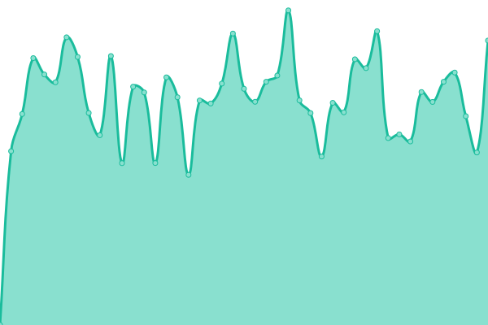
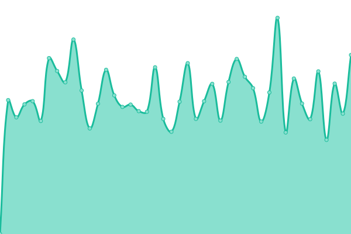
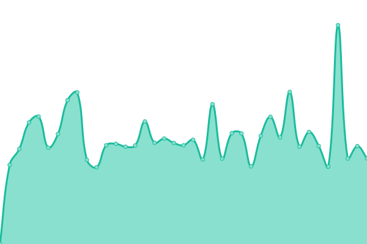
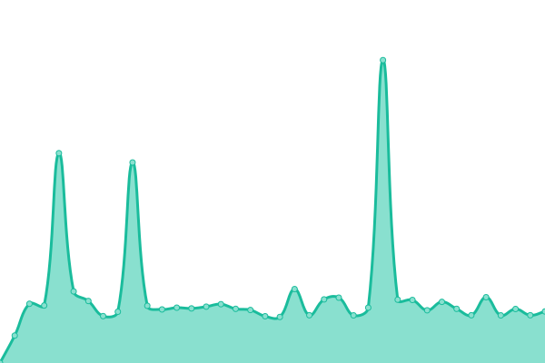

# [📈 Live Status](https://NCU-2023-Linux-Term.github.io/upptime): <!--live status--> **🟧 Partial outage**

This repository contains the open-source uptime monitor and status page for [NCU-2023-Linux-Term](https://NCU-2023-Linux-Term.github.io/upptime), powered by [Upptime](https://github.com/upptime/upptime).

With [Upptime](https://upptime.js.org), you can get your own unlimited and free uptime monitor and status page, powered entirely by a GitHub repository. We use [Issues](https://github.com/NCU-2023-Linux-Term/upptime/issues) as incident reports, [Actions](https://github.com/NCU-2023-Linux-Term/upptime/actions) as uptime monitors, and [Pages](https://NCU-2023-Linux-Term.github.io/upptime) for the status page.

<!--start: status pages-->
<!-- This summary is generated by Upptime (https://github.com/upptime/upptime) -->
<!-- Do not edit this manually, your changes will be overwritten -->
<!-- prettier-ignore -->
| URL | Status | History | Response Time | Uptime |
| --- | ------ | ------- | ------------- | ------ |
|  [NCU_main_中央大學官網](https://www.ncu.edu.tw/tw/) | 正常運作 | [ncu-main.yml](https://github.com/NCU-2023-Linux-Term/upptime/commits/HEAD/history/ncu-main.yml) | 

 1752ms
     
 | 

<a href="https://NCU-2023-Linux-Term.github.io/upptime/history/ncu-main">100.00%</a>
    

|  [NCU_OSA_中央大學學務處](https://osa.ncu.edu.tw/index.php) | 中斷連線 | [ncu-osa.yml](https://github.com/NCU-2023-Linux-Term/upptime/commits/HEAD/history/ncu-osa.yml) | 

 0ms
     
 | 

<a href="https://NCU-2023-Linux-Term.github.io/upptime/history/ncu-osa">0.00%</a>
    

|  [NCU_ADM_中央大學教務處](https://pdc.adm.ncu.edu.tw/) | 正常運作 | [ncu-adm.yml](https://github.com/NCU-2023-Linux-Term/upptime/commits/HEAD/history/ncu-adm.yml) | 

 1774ms
     
 | 

<a href="https://NCU-2023-Linux-Term.github.io/upptime/history/ncu-adm">100.00%</a>
    

|  [NCU_OIA_中央大學國際處](https://www.oia.ncu.edu.tw/index.php/tw/) | 正常運作 | [ncu-oia.yml](https://github.com/NCU-2023-Linux-Term/upptime/commits/HEAD/history/ncu-oia.yml) | 

 1524ms
     
 | 

<a href="https://NCU-2023-Linux-Term.github.io/upptime/history/ncu-oia">100.00%</a>
    

|  [RASPI_自己偷架的樹莓派](http://140.115.16.220) | 正常運作 | [raspi.yml](https://github.com/NCU-2023-Linux-Term/upptime/commits/HEAD/history/raspi.yml) | 

 481ms
     
 | 

<a href="https://NCU-2023-Linux-Term.github.io/upptime/history/raspi">100.00%</a>
    

<!--end: status pages-->

[**Visit our status website →**](https://NCU-2023-Linux-Term.github.io/upptime)

## 📄 License

- Powered by: [Upptime](https://github.com/upptime/upptime)
- Code: [MIT](./LICENSE) © [NCU-2023-Linux-Term](https://NCU-2023-Linux-Term.github.io/upptime)
- Data in the `./history` directory: [Open Database License](https://opendatacommons.org/licenses/odbl/1-0/)
